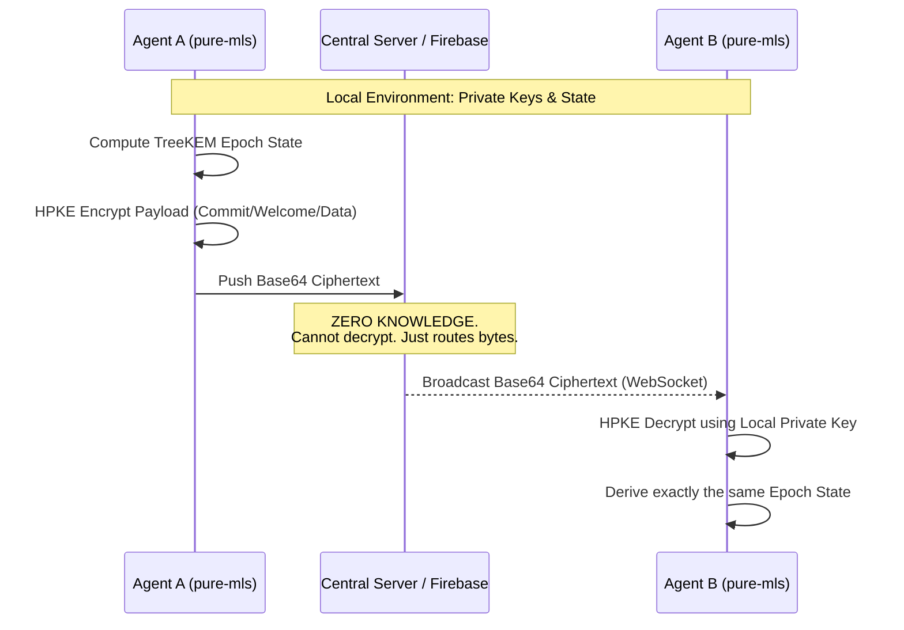

# The `pure-mls` Architecture

This document outlines how [RFC 9420 (MLS)](https://datatracker.ietf.org/doc/rfc9420/) maps to our pure-Python architecture.
**Current version: v0.4.0 — Engineering Grade certified. 44/44 tests green.**

## 1. The Separation of Concerns
Following strict software engineering guidelines, the library is decoupled into 4 distinct layers:

### Layer 1: Core Cryptography (`pure_mls.crypto`)
- This layer wraps standard Python libraries (like the standard `hashlib`, `hmac`, and `cryptography.io` curves) into MLS-compliant Ciphersuites.
- Handles HKDF (HMAC-based Key Derivation Function) Extract and Expand.
- Handles HPKE (Hybrid Public Key Encryption - RFC 9180) which is mandatory for MLS `Welcome` messages and tree updates.

### Layer 2: The TreeKEM Mathematics (`pure_mls.tree`)
- Implements the Left-Balanced Binary Tree required by MLS.
- `Node` classes: `LeafNode`, `ParentNode`.
- Path resolution logic: Computing direct paths, copaths, and node resolutions when a leaf updates its keys.

### Layer 3: Group State Machine (`pure_mls.epoch`)
- `EpochState`: The immutable object holding the current State (Tree, Group ID, Epoch ID, Current Key Schedule).
- Manages the derivation of the `SenderDataSecret`, `EncryptionSecret`, and `ConfirmationKey` from the `EpochAuthenticator`.

### Layer 4: High Level API / Framing (`pure_mls.group`)
- The developer-facing API: `MlsGroup`.
- `add_member()`, `remove_member()`, `update()`.
- Generates `MLSCiphertext` (fully framed and encrypted end-to-end messages ready for network distribution).

---

## 2. Bootstrapping Strategy — Implementation Status

| Milestone | Status | Notes |
|---|---|---|
| HKDF / HPKE wrappers | ✅ Done | RFC 5869, RFC 9180, labeled extract/expand |
| Binary tree math | ✅ Done | LBBT, path resolution, copaths |
| Group State Machine | ✅ Done | EpochState, KeySchedule, MLSGroup |
| Framing (Commit/Welcome) | ⚠️ Partial | Custom binary, see RFC TLS Wire Format below |
| App Message Encryption | ✅ Done | AES-256-GCM, group application key |
| Storage (AsyncEncryptedStore) | ✅ Done | AES-GCM encrypted persistence |
| **RFC TLS Wire Format** | 🔲 v1.0 | GroupContext, Welcome RFC, Commit RFC, MLSMessage |

---

## 3. The Zero-Knowledge Transport Layer (The Dumb Pipe)
Unlike traditional chat architectures, `pure-mls` mathematically separates the cryptographic engine from the delivery network (e.g., Firebase Realtime Database, IPFS, WebSockets). 

- **Agnostic Delivery**: The server is treated as a "dumb pipe" or a passive bulletin board. 
- **Zero-Knowledge**: The central server NEVER performs handshakes, NEVER negotiates keys, and NEVER parses the content of the `Welcome`, `Commit`, or `Application` messages. It only routes Base64 ciphertexts.
- **P2P State Consensus**: State management and logic reside entirely in the client endpoints. Real-time Pub/Sub networks like Firebase simply push identical bytes to all subscribed nodes effortlessly without understanding the cryptographic state.

### Visual Architecture

---

## 4. RFC 9420 Compliance Status (v0.4.0)

| RFC §  | Feature | Status | Notes |
|---|---|---|---|
| §8.2 | GroupInfo transcript hash — Sender struct | ✅ Compliant | group_id, cipher_suite, epoch, tree, SenderType(0x01)+leaf_index |
| §10.2 | `KeyPackageRef` = `RefHash("MLS 1.0 KeyPackageRef", kp)` | ✅ Compliant | labeled HKDF-Expand, Nh=32 bytes |
| §11 | Path secrets HPKE info = `GroupContext` | 🔲 v1.0 | currently uses custom string `b"mls10-commit-secret"` |
| §12 | `Welcome` / `Commit` TLS-style encoding | 🔲 v1.0 | custom binary `WelcomeInfo` / `GroupUpdate`, not interoperable |
| RFC 9180 | HPKE Base Mode (KEM+KDF+AEAD) | ✅ Compliant | SUITE_ID, labeled extract/expand, XOR nonce counter |
| RFC 5869 | HKDF Extract + Expand | ✅ Compliant | — |

> **Known Limitation**: Custom binary serialization is not interoperable with other MLS
> implementations. Will be replaced by RFC TLS-style encoding in v1.0, implementing
> `GroupContext`, and dropping custom HPKE info strings.
