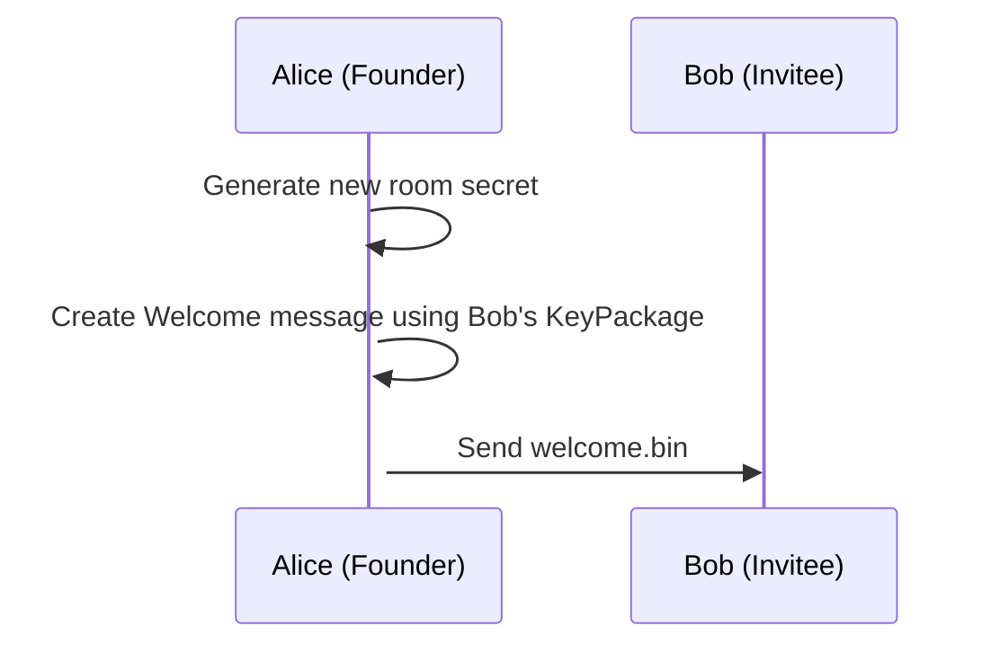
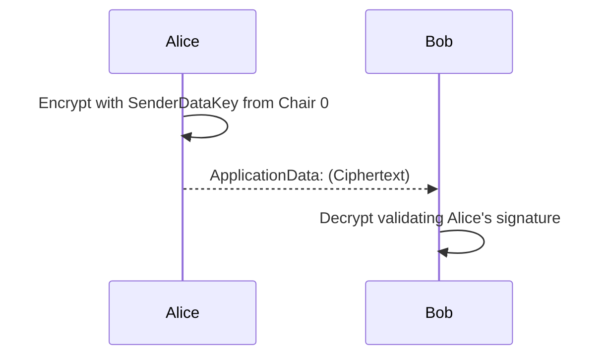
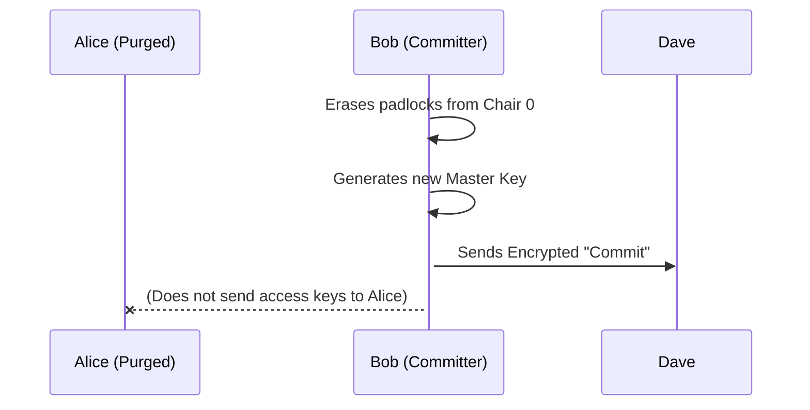

# The Human Guide to MLS: The Journey (Message Layer Security)

This guide is an interactive story. It is the translation of the cold mathematical gears of RFC 9420 into a language we can understand and visualize without getting lost in technical jargon. We will demonstrate the theory using the `pure-mls` command-line tool.

We will follow four characters in this story: **Alice**, **Bob**, **Jane** and **Peter**, later we will meet **Dave**.

---

## Prologue: The Open Mailboxes (`KeyPackages`)

Before a group even exists, in the world of MLS there is a public directory. Imagine it as the grand entrance of a post office, full of glass lockers.

Anyone who wants to be invited to secret clubs in the future must go to that post office and leave a package in an open locker.
That package is called a **`KeyPackage`**.

What does Bob put inside his `KeyPackage`?
1. **A public identity padlock (`SignatureKey`)**: With this, people will be able to verify if a signature really is Bob's.
2. **A public messaging padlock (`KemKey`)**: If someone wants to whisper a secret to Bob to invite him to a group, they will lock the message with this padlock. Only Bob's private key will be able to open it.

Jane and Peter do the same. They leave their `KeyPackage` in the post office and go home to wait.

**💻 Console Reproduction (`pure-mls`)**
To create these identities in our environment:
```bash
pure-mls keygen alice
pure-mls keygen bob
pure-mls keygen jane
pure-mls keygen peter
pure-mls keygen dave
```
> This will generate the `.pub` files (The KeyPackages in the open mailbox) and the `.priv` files (The keys that each one guards jealously at home).

---

## Chapter 1: Founding the Club (`Group Creation`)

One day, **Alice** decides she wants to organize a clandestine committee. 
Alice cannot "join" something that does not exist, so she founds the group from scratch.

Creating the group is a solitary act. Alice:
1. Buys a large round table (the **`RatchetTree`** or Key Tree). 
2. Sits in the very first chair, chair number 0 (**Leaf 0**).
3. Generates the first great secret of the table: a random "master key" (`joiner_secret`) from which all the encryption keys of that club will be born from now on.
4. Generates the founding charter: *"Club created today. Sole member: Alice (Chair 0)"*. 

At this moment, Alice is alone in the room. It is safe, but boring.

**💻 Console Reproduction:**
```bash
pure-mls create-group cyberpunk alice.priv -o cyberpunk.state.alice
```

---

## Chapter 2: Passing out the Invitations (`Add` and `Welcome`)

Alice wants to invite Bob. To do so 100% securely, the MLS protocol prohibits passing passwords in "plaintext". A brilliant mechanism called the **`Welcome`** message is used.

Step by step, the magic happens like this:

1. **Collecting padlocks:** Alice goes to the public office and grabs Bob's `KeyPackage`.
2. **Arranging chairs (`RatchetTree`):** Alice adds an empty chair to her right. Chair 1: Bob.
3. **Hiding the Group Secret:** Alice puts a copy of the group's master key in a small lockbox and closes it using **Bob's messaging padlock**.
4. **Drafting the Initial Charter (`GroupInfo`):** Alice takes a parchment and writes: *"Inaugural charter. We are using this cipher, and for now at the table we are Alice and Bob"*. Finally, she **stamps her signature**.



**💻 Console Reproduction:**
```bash
# Alice adds Bob using Bob's public file and generates the Welcome
pure-mls add-member cyberpunk.state.alice bob.pub -w welcome.bin -o cyberpunk.state.alice
```

---

## Chapter 3: The Arrival of the Newcomer (Unboxing)

The `Welcome` message is finished. When **Bob** receives it, he springs into action:

1. **Opening the box:** Bob uses his private key (`bob.priv`) to remove the padlock. Click! He obtains the Group Secret.
2. **Unrolling the parchment:** Using that decrypted secret, he removes the encrypted wrapper from Alice's charter (`GroupInfo`). 
3. **The Ultimate Security Check:** Bob mathematically verifies Alice's wax signature against the `RatchetTree`. If they match, Bob safely enters the chat.

**💻 Console Reproduction:**
```bash
# Bob processes the invitation using his private keys and the welcome file
pure-mls join-group welcome.bin bob.priv -o cyberpunk.state.bob
```

Both are in! The group is formed! From now on, they both share the exact same mathematical "State".

### 💬 Simulating the Communication (`ApplicationData`)
Now that they share cryptographic keys, they can pass end-to-end encrypted messages:

*Theoretical Note: The current Pure-MLS CLI is focused on managing the group lifecycle (RFC 9420), but at the protocol level, communication would look like this:*

```bash
# [THEORETICAL SIMULATION]
> pure-mls send-message cyberpunk.state.alice "Hello Bob! Welcome to the resistance."
> pure-mls read-messages cyberpunk.state.bob
[Alice]: Hello Bob! Welcome to the resistance.
```



---

## Chapter 4: The Surprise Guest (`Proposals` and `Commits`)

The party has already started. Suddenly, Bob says: *"Hey, we should invite **Dave** to the club!"*.

Dave was not in the original invitations. Dave is at his house. To bring Dave in, MLS does something very elegant. It divides the action into two moments:

### 1. The Motion (`Add Proposal`)
No one puts someone directly into the room. Bob brings Dave's `KeyPackage` to the table and puts a proposal on the table.

### 2. The Gavel Strike (`Commit`)
A proposal does nothing by itself. Someone has to grab the gavel and say: *"Proposals approved!"*. Let's say **Alice** does it (or Bob, it wouldn't matter).

By striking the gavel with the `Commit`, things happen at lightning speed:
1. **New Secret:** The room's master key changes for security.
2. **Key to Veterans:** The new secret is distributed and approved among the group's veterans.
3. **Package for Dave:** A `Welcome` message is EXCLUSIVELY built for Dave.

**💻 Console Reproduction:**
```bash
# Assuming Bob (or Alice) issues the commit to add Dave
pure-mls add-member cyberpunk.state.alice dave.pub -w dave_welcome.bin
```

---

## Chapter 5: Nobody is the Boss (Alice's Farewell)

**In MLS there are no "Administrators".** All participants enjoy the same privileges. To prove this, let's imagine that **Alice** (the founder of the club) decides to leave or is kicked out.

There is no "Owner" to delete the group. 

### 1. Raising a Hand (`Remove Proposal`)
Someone at the table generates a motion to remove Alice's Chair.

### 2. Changing the Locks (Forward Secrecy)
When someone strikes the gavel (`Commit`) to kick Alice out, they do something fundamental for the club's security:
1. **Erases Chair 0:** Alice's face is removed from the head chair. It becomes a "Blank Node".
2. **Changes the Lock (Again!):** A totally new group password is generated. Alice cannot leave taking the old key.
3. **Distributes keys only to loyalists:** The dark magic of TreeKEM communicates the new password only using Bob and Dave's padlocks limitlessly.



Alice tries to look through the window using her old key. But no one has encrypted the new key for her. The window becomes opaque. She knows she has been purged.

**The group survives its creator.** The club now belongs to Bob and Dave.
