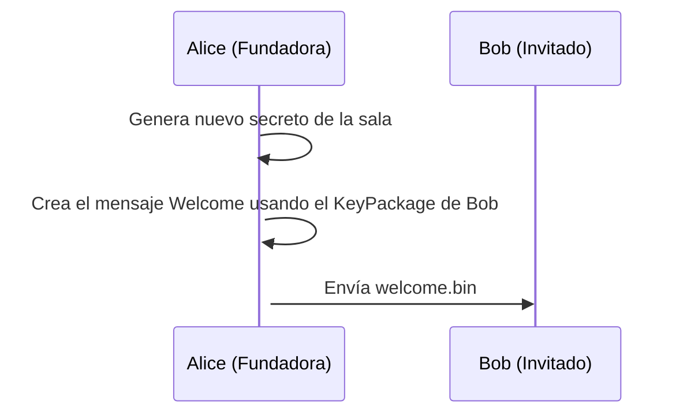
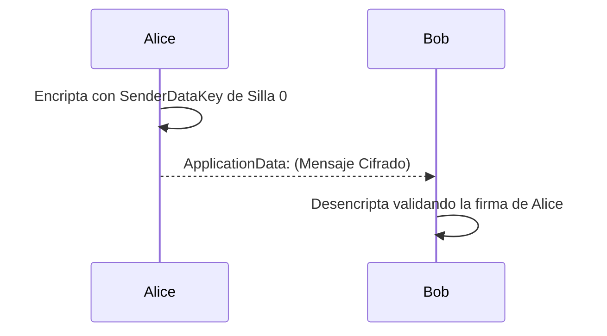
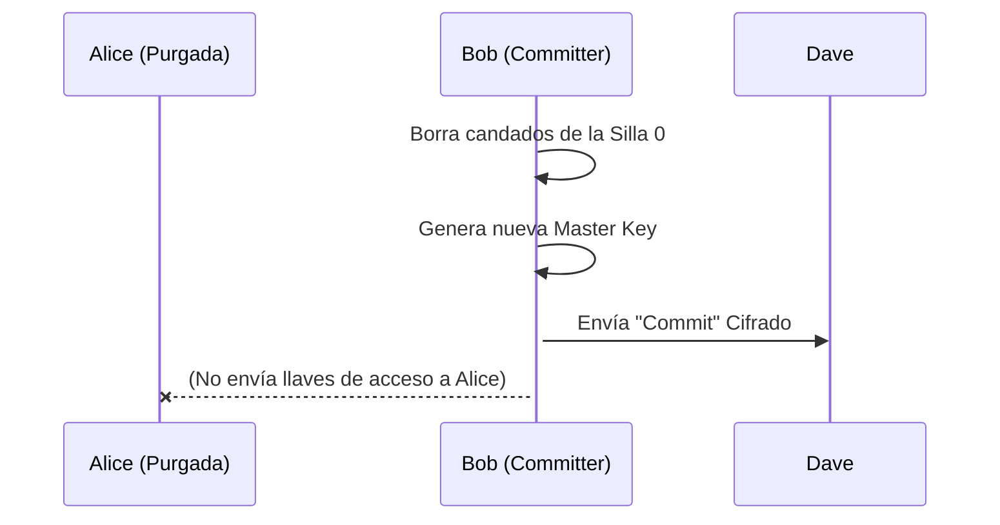

# La Guía Humana de MLS: El Viaje (Message Layer Security)

Esta guía es un cuento interactivo. Es la traducción de los fríos engranajes matemáticos del RFC 9420 a un idioma que podemos entender y visualizar sin perdernos en jerga técnica. Demostraremos la teoría utilizando la herramienta de línea de comandos `pure-mls`.

Vamos a seguir a cuatro personajes en esta historia: **Alice**, **Bob**, **Jane** y **Peter**, más tarde conoceremos a **Dave**.

---

## Prólogo: Los Buzones Abiertos (`KeyPackages`)

Antes siquiera de que exista un grupo, en el mundo de MLS existe un directorio público. Imagina que es como la gran entrada de una oficina postal, llena de casilleros de cristal.

Cualquiera que quiera que le inviten a clubes secretos en el futuro, debe ir a esa oficina de correos y dejar un paquete en su casillero abierto.
Ese paquete se llama **`KeyPackage`** (Paquete de Claves).

¿Qué mete Bob dentro de su `KeyPackage`?
1. **Un candado público de identidad (`SignatureKey`)**: Con esto la gente podrá verificar si una firma realmente es de Bob.
2. **Un candado público para mensajes (`KemKey`)**: Si alguien quiere susurrarle un secreto a Bob para invitarle a un grupo, cerrará el mensaje con este candado. Solo la llave privada de Bob podrá abrirlo.

Jane y Peter hacen lo mismo. Dejan sus `KeyPackage` en la oficina postal y se van a casa a esperar.

**💻 Reproducción en Consola (`pure-mls`)**
Para crear estas identidades en nuestro entorno:
```bash
pure-mls keygen alice
pure-mls keygen bob
pure-mls keygen jane
pure-mls keygen peter
pure-mls keygen dave
```
> Esto generará los archivos `.pub` (Los KeyPackages en el buzón abierto) y los archivos `.priv` (Las llaves que cada uno guarda celosamente en casa).

---

## Capítulo 1: Fundando el Club (`Group Creation`)

Un día, **Alice** decide que quiere organizar un comité clandestino. 
Alice no puede "unirse" a algo que no existe, así que ella funda el grupo desde cero.

Crear el grupo es un acto solitario. Alice:
1. Compra una gran mesa redonda (el **`RatchetTree`** o Árbol de Claves). 
2. Se sienta en la mismísima silla número 0 (**Leaf 0**).
3. Genera el primer gran secreto de la mesa: una "llave maestra" aleatoria (`joiner_secret`) a partir de la cual nacerán todas las claves de encriptación de ese club de ahora en adelante.
4. Genera el acta constitutiva: *"Club creado hoy. Único miembro: Alice (Silla 0)"*. 

En este momento, Alice está sola en la sala. Es seguro, pero aburrido.

**💻 Reproducción en Consola:**
```bash
pure-mls create-group cyberpunk alice.priv -o cyberpunk.state.alice
```

---

## Capítulo 2: Repartiendo las Invitaciones (`Add` y `Welcome`)

Alice quiere invitar a Bob. Para hacerlo de forma 100% segura, el protocolo MLS prohíbe pasar contraseñas "en claro". Se utiliza un mecanismo brillante llamado el mensaje **`Welcome`**.

Paso a paso, la magia ocurre así:

1. **Recogiendo candados:** Alice va a la oficina pública y agarra el `KeyPackage` de Bob.
2. **Acomodando sillas (`RatchetTree`):** Alice añade una silla vacía a su derecha. Silla 1: Bob.
3. **Escondiendo el Secreto del Grupo:** Alice mete una copia de la llave maestra del grupo en una caja fuerte y la cierra usando el **candado de mensajes de Bob**.
4. **Levantando el Acta Inicial (`GroupInfo`):** Alice toma un pergamino y escribe: *"Acta inaugural. Estamos usando este cifrado, y de momento en la mesa estamos Alice y Bob"*. Finalmente **estampa su firma**.



**💻 Reproducción en Consola:**
```bash
# Alice añade a Bob usando el archivo público de Bob y genera el Welcome
pure-mls add-member cyberpunk.state.alice bob.pub -w welcome.bin -o cyberpunk.state.alice
```

---

## Capítulo 3: La Llegada del Nuevo (El Desembalaje)

El mensaje `Welcome` ya está terminado. Cuando **Bob** lo recibe, entra en acción:

1. **Abriendo la cajita:** Bob usa su llave privada (`bob.priv`) para quitar el candado. ¡Click! Obtiene el Secreto del Grupo.
2. **Desenrollando el pergamino:** Usando ese secreto desencriptado, le quita la envoltura cifrada al acta de Alice (`GroupInfo`). 
3. **El Control de Seguridad Definitivo:** Bob verifica matemáticamente la firma de cera de Alice en el `RatchetTree`. Si coincide, Bob entra seguro al chat.

**💻 Reproducción en Consola:**
```bash
# Bob procesa la invitación usando sus llaves privadas y el welcome
pure-mls join-group welcome.bin bob.priv -o cyberpunk.state.bob
```

¡Ambos están dentro! ¡El grupo está formado! A partir de ahora, ambos comparten el mismo "Estado".

### 💬 Simulando la Comunicación (`ApplicationData`)
Ahora que comparten las llaves criptográficas, pueden pasarse mensajes cifrados de extremo a extremo:

*Nota Teórica: El CLI actual de Pure-MLS está enfocado en la gestión del ciclo de vida del grupo (RFC 9420), pero a nivel protocolo la comunicación se vería así:*

```bash
# [SIMULACIÓN TEÓRICA]
> pure-mls send-message cyberpunk.state.alice "¡Hola Bob! Bienvenido a la resistencia."
> pure-mls read-messages cyberpunk.state.bob
[Alice]: ¡Hola Bob! Bienvenido a la resistencia.
```



---

## Capítulo 4: El Invitado Sorpresa (`Proposals` y `Commits`)

La fiesta ya ha empezado. De repente, Bob dice: *"¡Oye, deberíamos invitar a **Dave** al club!"*.

Dave no estaba en las invitaciones originales. Dave está en su casa. Para traer a Dave, MLS hace algo muy elegante. Divide la acción en dos momentos:

### 1. La Moción (`Add Proposal`)
Nadie mete a alguien en la sala directamente. Bob trae a la mesa el `KeyPackage` de Dave y pone una propuesta en la mesa.

### 2. El Golpe de Mazo (`Commit`)
Una propuesta no hace nada por sí sola. Alguien tiene que agarrar el mazo de presidente y decir: *"¡Aprobadas las propuestas!"*. Digamos que es **Alice** quien lo hace (o Bob, daría igual).

Al dar el golpe de mazo con el `Commit`, ocurren cosas a velocidad de vértigo:
1. **Nuevo Secreto:** La llave maestra de la sala cambia por seguridad.
2. **Llave a Veteranos:** Se distribuye y aprueba el nuevo secreto entre los veteranos del grupo.
3. **Paquete para Dave:** Se construye un mensaje `Welcome` EXCLUSIVAMENTE para Dave.

**💻 Reproducción en Consola:**
```bash
# Asumiendo que Bob (o Alice) lanza el commit para añadir a Dave
pure-mls add-member cyberpunk.state.alice dave.pub -w dave_welcome.bin
```

---

## Capítulo 5: Nadie es el Jefe (La Despedida de Alice)

**En MLS no hay "Administradores".** Todos los participantes gozan de los mismos privilegios. Para demostrarlo, imaginemos que **Alice** (la fundadora del club) decide irse o la echan.

No hay un "Dueño" que borre el grupo. 

### 1. Levantando la mano (`Remove Proposal`)
Alguien en la mesa genera una moción para eliminar la Silla de Alice.

### 2. El Cambio de Cerraduras (Forward Secrecy)
Cuando alguien pega el golpe de mazo (`Commit`) para echar a Alice, hace algo fundamental para la seguridad del club:
1. **Borra la Silla 0:** Se elimina la cara de Alice de la silla de la cabecera. Es un "Blank Node".
2. **Cambia la cerradura (¡Otra vez!):** Se genera una contraseña de grupo totalmente nueva. Alice no puede salir llevándose la llave vieja.
3. **Reparte llaves solo a leales:** La magia negra de TreeKEM comunica la nueva contraseña solo usando los candados de Bob y Dave.



Alice intenta mirar por la ventana usando su llave vieja. Pero nadie ha encriptado la nueva llave para ella. La ventana se vuelve opaca. Sabe que ha sido purgada.

**El grupo sobrevive a su creador.** El club es ahora de Bob y Dave.
