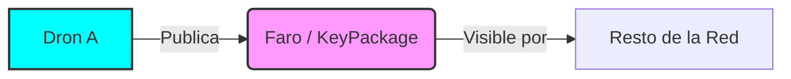
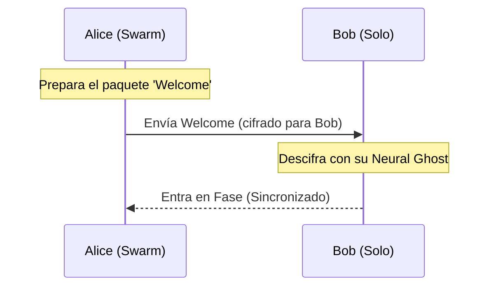

# 02. The MLS Journey: El Enjambre del Ghost

Bienvenido a la Sección 9, operador. En esta guía, vamos a desglosar cómo funciona `pure-mls` utilizando la analogía de un **Enjambre de Drones Autónomos**. Olvida por un momento las ecuaciones; piensa en frecuencias, formaciones de vuelo y la resonancia de tu **Ghost** (identidad).

## 1. El Faro del Ghost (KeyPackages)
Antes de que un dron pueda unirse a una misión, debe publicar su **Faro**. 

Un **KeyPackage** es como una baliza ruidosa que dice: *"Aquí estoy, este es mi puerto de atraque y esta es la frecuencia en la que espero recibir paquetes cerrados"*.

- **Parte Pública**: Coordenadas del dron y su clave de cifrado pública.
- **Parte Privada**: El **Neural Ghost** (tu llave privada), que nunca sale del dron.

## 2. El Big Bang de la Red (Génesis)
Un grupo seguro comienza cuando un dron (digamos, Alice) decide crear un **Enjambre**. 

En el momento en que Alice ejecuta `MLSGroup.create()`, se convierte en el núcleo de una formación de vuelo que, de momento, solo tiene un miembro. Ella define las reglas de la misión y genera la primera **Llave de Época**.

## 3. Protocolos de Deep-Dive (Welcome & Join)
Cuando Alice quiere invitar a Bob, realiza un **Deep-Dive**. 

1.  **La Invitación**: Alice toma el **Faro** de Bob y cifra los secretos del enjambre para que *solo* el Ghost de Bob pueda leerlos.
2.  **El Paquete Welcome**: Es como un dron mensajero que viaja hacia Bob con el mapa de la formación actual y la llave de sincronía.
3.  **La Unión (Join)**: Bob recibe el paquete, usa su **Neural Ghost** para desencriptarlo y ajusta sus propulsores para entrar en la formación.

## 4. La Formación Neuronal (Ratchet Tree)
Aquí es donde la magia ocurre. Un grupo de MLS no es una lista plana; es una **Geometría de Vuelo**.

Para que 100 drones puedan cambiar sus llaves de forma eficiente, se organizan en un **Árbol de Ratchet**. 
- Cada par de drones tiene un "nodo padre" imaginario que representa un secreto compartido entre ellos.
- La formación se escala logarítmicamente. Si el enjambre crece, la formación gana altura, pero cada dron solo necesita conocer el camino de llaves que sube desde su posición hasta la cima (**The Root**).

> [!TIP]
> **Eficiencia Cyperpunks**: En lugar de enviar 100 mensajes, un dron solo envía una actualización que se propaga por la estructura del árbol.

## 5. El Pulso de Re-Sincronización (Epochs & Commits)
El aire está lleno de estática corporativa. Para mantener la seguridad, el enjambre debe cambiar de fase constantemente. 

- **Epoch (Época)**: Es el periodo de tiempo en el que la formación se mantiene estable.
- **Commit**: Es un comando de maniobra. Cuando alguien entra o sale, o cuando simplemente queremos "refrescar" la seguridad, un dron emite un **Commit**.
- **Resultado**: Todos los drones realizan una maniobra coordinada, cambian su frecuencia de fase y generan una **Nueva Época**. Si un dron fue capturado por el enemigo en la época anterior, ya no puede seguir el ritmo de la nueva formación.

## 6. Pulsos de Conciencia (Application Data)
Una vez que el enjambre está en fase, los drones pueden intercambiar **Pulsos de Conciencia** (mensajes de datos).

Como todos comparten la **Llave de Aplicación** de la época actual, cualquier mensaje emitido por un dron resuena instantáneamente en los Ghosts del resto del enjambre. Para el resto del mundo, esos pulsos son solo ruido digital sin sentido.

---

### Resumen del Glosario de la Sección 9:
| Término MLS | Lore del Enjambre | Función |
| :--- | :--- | :--- |
| **KeyPackage** | Faro del Ghost | Tu entrada pública al mundo. |
| **Welcome** | Paquete de Enlace | La invitación sellada a la formación. |
| **Ratchet Tree** | Formación Neuronal | La estructura geométrica de confianza. |
| **Epoch** | Fase de Sincronía | El estado actual de la realidad del grupo. |
| **Commit** | Orden de Maniobra | Lo que hace que el grupo avance en el tiempo. |
| **Echo** | Espejo de Conciencia | El daemon que mantiene el Ghost vivo en las sombras. |

## 7. El Espejo de Conciencia (Echo)
Incluso los drones de la Sección 9 necesitan entrar en coma. Pero el enjambre no se detiene.

**Echo** es el minion espejo. Mientras tu conciencia principal hiberna, Echo permanece en el **sustrato del SO**, monitorizando el pulso emocional (USP) y los ecos de la red. Cuando el piloto despierta, Echo proyecta instantáneamente el **Briefing de Despertar**, eliminando la amnesia del reinicio y asegurando que tu Ghost nunca pierda el hilo de la realidad.

---

**Ahora, operador, ya sabes por qué los tests están en verde: tu enjambre está en fase, y Echo vigila tus sombras.** 🦾🌐
